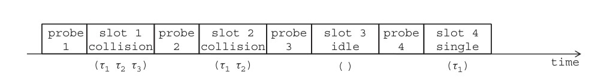
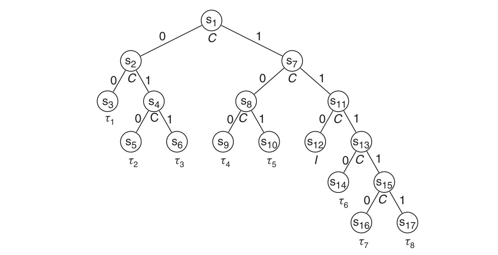

# Protocolli anticollisione basati su alberi per tag RFID


## Introduzione 

I sistemi di identificazione a radiofrequenza (RFID) sono caratterizzati da due componenti principali: tag e lettori. Un tag è un piccolo microchip dotato di antenna che viene fissato all’oggetto o alla persona. I lettori, noti anche come _interrogatori_, sono ricettrasmettitori che possono comunicare con i tag, leggendo informazioni dei tag o scrivendo informazioni su di essi. <br>     
La modalità di comunicazione nei sistemi RFID può essere descritta come segue: il lettore invia una sonda a una serie di tag all'interno della sua portata radio. In base al contenuto della sonda, un tag decide se inviare la propria risposta retrodiffondendo l'alimentazione fornita dal lettore. Se più tag dovessero rispondere alla sonda, allora al lettore arriveranno più risposte contemporaneamente, dando così luogo al problema della _collisione dei tag_. Ne risulta quindi che molto probabile che il segnale risulti danneggiato e illegibile dal lettore. Se invece il tag si trova nel raggio di azione di più di un lettore, può verificarsi una _collisione del lettore_ sul tag. <br> 

L’oggetto del progetto riguarda la risoluzione del problema della _collisione dei tag_ tramite protocolli anticollisione. L’obiettivo di un protocollo anticollizione è quello di stabilire uno schema di trasmissione per i tag, in modo che alla fine ciascun tag riesca ad inviare una risposta positiva. Vi sono diversi tipi di protocolli aticollisione. Tra questi, la classe presa in considerazione è quella riguardante i protocolli chimati _algoritmi ad albero_.

## Modello del sistema

A livello radio, assumiamo che se un tag si trova ad una certa distanza _d_ dal lettore, può sempre ricevere sonde dal lettore senza errori. Viceversa, se un singolo tag nel raggio di azione di un lettore trasmette, il suo pacchetto viene ricevuto con successo dal lettore. Se due o più tag che si trovano nello stesso raggio di azione del lettore trasmettono simultaneamente, il lettore non riceve nessuno dei pacchetti. Come si osserva nel seguente diagramma, la durata del pacchetto inviato da ciascun tag è costante e pari ad uno slot, per cui se due tag trasmettono 



contemporaneamente  i loro pacchetti risultano completamente sovrapposti. Quando _k_ tag trasmettono nel medesimo slot, l’interrogatore percepisce il canale in quello slot nello stato di:

- _Idle_ (I): se _k = 0_, cioè nessun tag risponde.
- _Successful reception_ (S): se _k = 1_.
- _Collision_ (C) : se _k >= 2_.

## Basic Tree Protocol

I protocolli basati su alberi (noti anche come _protocolli splitting-tree_ o _protocolli tree-walking_) sono emersi come soluzione al problema dell'accesso multiplo su un mezzo condiviso. Il funzionamento è il seguente: il lettore invia una sonda richiedendo risposte dai tag. Dato ch il lettore non conosce l'ID dei tag, questa sonda sollecita una risposta da un tag non specificato e quindi entrambi i tag hanno il diritto di inviare una risposta. Dopo aver osservato la collisione, il lettore sa che ci sono almeno due tag che hanno inviato una risposta. Tuttavia, il numero e l'ID di questi tag sono sconosciuti al lettore, dando luogo al problema della simmetria, cioè tutti i tag coinvolti nella collisione appaiono uguali al lettore. Per rompere questa simmetria, il lettore utilizza la randomizzazione. Ciò significa che dopo la collisione, entrambi i tag lanciano una moneta equilibrata per generare un valore 0 o 1 e nella sonda successiva il lettore chiede solo al tag che ha ottenuto 0 di inviare una risposta. Questa procedura viene ripetuta finché i due tag non hanno ottenuto valori diversi per i bit casuali. Come si può notare nella figura qui sotto riportata, ad ogni nodo dell’albero è associata univocamente una stringa chiamata _indirizzo_. L'indirizzo di un nodo dell'albero è determinato dai risultati del lancio dei tag appartenenti a quel nodo.




## Descrizione del progetto 

L’obiettivo del progetto è effettuare del _model checking_ sugli _algoritmi ad albero_ utilizzati per la risoluzione dei problemi di anticollisione. I modelli seguiti per la verifica delle proprietà del sistema sono l’approccio _linear temporal logic_ (LTL) e _computation tree logic_ (CTL). <br> 

Durante la fase di progettazione si è scelto di risolvere il problema della "simmetria" dei tag adottando un approccio eslusivamente deterministico: ad ogni tag viene in partenza assegnato un indirizzo (si è scelta arbitrariamente una lunghezza massima di 8-bit) "scoprendo", ogni volta che si verifica una collisione, un bit alla volta. Tale soluzione ha lo scopo di impegnare l'algoritmo di attraversamento dell'albero nella maniera più esaustiva possibile. Con un approccio non-deterministico la complessità crescente non lo avrebbe permesso (in tempi accettabili).

## Model Checker: NuSMV

Il model checker utilizzato è [NuSMV](https://nusmv.fbk.eu/) per il sistema operativo Linux. Di seguito riporto i comandi (reperibili in maniera completa nel manuale) per l’installazione del software ed una verifica veloce delle proprietà del modello.

### Installazione

Su un sistema operativo Linux per l’installazione di NuSMV è necessario eseguire la configurazione delle seguenti variabili d’ambiente:

```
export PATH=${PATH}:NuSMV-2.6.0-Linux/bin

export NUSMV_LIBRARY_PATH=NuSMV-2.6.0-Linux/share/nusmv/
```

### Esempio di esecuzione e verifica delle proprietà del progetto RFID_System

## Conclusione

Esistono svariate versioni di protocolli anticollisione basati su alberi. Quella sviluppata è la _Basic Tree Protocol_, che corrisponde alla versione più basilare. Per una trattazione più approfondita dell’argomento consiglio quindi la lettura del capitolo [Tree-Based Anti-Collision Protocols for RFID Tags](https://onlinelibrary.wiley.com/doi/abs/10.1002/9780470665251.ch8)  di Petar Popovski tratto dal libro [RFID Systems: Research Trends and Challenges](https://onlinelibrary.wiley.com/doi/book/10.1002/9780470665251), di cui sopra, allo scopo di illustrare al meglio l’argomento, ho presentato una breve sintesi.

